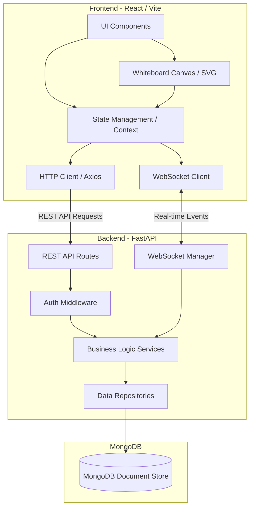

# Component Diagram

```mermaid
graph TD
    subgraph Frontend [Frontend - React / Vite]
        UI[UI Components]
        State[State Management / Context]
        WS_Client[WebSocket Client]
        HTTP_Client[HTTP Client / Axios]
        Canvas[Whiteboard Canvas / SVG]
    end

    subgraph Backend [Backend - FastAPI]
        API[REST API Routes]
        WS_Manager[WebSocket Manager]
        Auth[Auth Middleware]
        Services[Business Logic Services]
        Repo[Data Repositories]
    end

    subgraph Database [MongoDB]
        DB[(MongoDB Document Store)]
    end

    UI --> State
    UI --> Canvas
    Canvas --> State
    State --> WS_Client
    State --> HTTP_Client

    HTTP_Client -->|REST API Requests| API
    WS_Client <-->|Real-time Events| WS_Manager

    API --> Auth
    Auth --> Services
    WS_Manager --> Services

    Services --> Repo
    Repo --> DB
```
