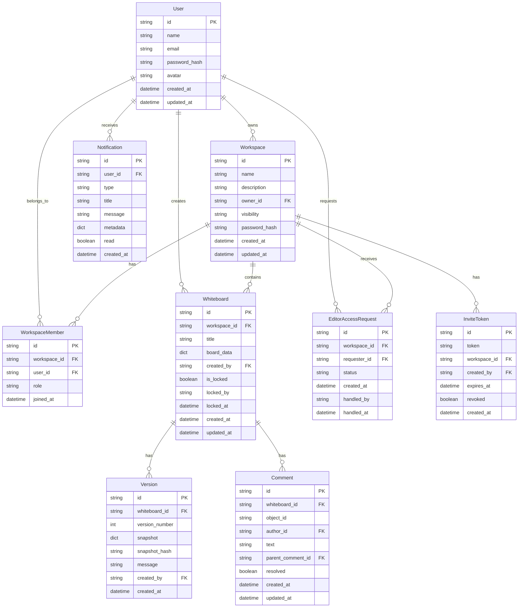

# Database Schema

```mermaid
erDiagram
    User ||--o{ Workspace : owns
    User ||--o{ WorkspaceMember : belongs_to
    User ||--o{ Whiteboard : creates
    User ||--o{ EditorAccessRequest : requests
    User ||--o{ Notification : receives
    Workspace ||--o{ WorkspaceMember : has
    Workspace ||--o{ Whiteboard : contains
    Workspace ||--o{ InviteToken : has
    Workspace ||--o{ EditorAccessRequest : receives
    Whiteboard ||--o{ Version : has
    Whiteboard ||--o{ Comment : has

    User {
        string id PK
        string name
        string email
        string password_hash
        string avatar
        datetime created_at
        datetime updated_at
    }
    
    Workspace {
        string id PK
        string name
        string description
        string owner_id FK
        string visibility
        string password_hash
        datetime created_at
        datetime updated_at
    }

    WorkspaceMember {
        string id PK
        string workspace_id FK
        string user_id FK
        string role
        datetime joined_at
    }

    Whiteboard {
        string id PK
        string workspace_id FK
        string title
        dict board_data
        string created_by FK
        boolean is_locked
        string locked_by
        datetime locked_at
        datetime created_at
        datetime updated_at
    }

    Version {
        string id PK
        string whiteboard_id FK
        int version_number
        dict snapshot
        string snapshot_hash
        string message
        string created_by FK
        datetime created_at
    }

    Comment {
        string id PK
        string whiteboard_id FK
        string object_id
        string author_id FK
        string text
        string parent_comment_id FK
        boolean resolved
        datetime created_at
        datetime updated_at
    }

    Notification {
        string id PK
        string user_id FK
        string type
        string title
        string message
        dict metadata
        boolean read
        datetime created_at
    }

    EditorAccessRequest {
        string id PK
        string workspace_id FK
        string requester_id FK
        string status
        datetime created_at
        string handled_by
        datetime handled_at
    }

    InviteToken {
        string id PK
        string token
        string workspace_id FK
        string created_by FK
        datetime expires_at
        boolean revoked
        datetime created_at
    }
```
