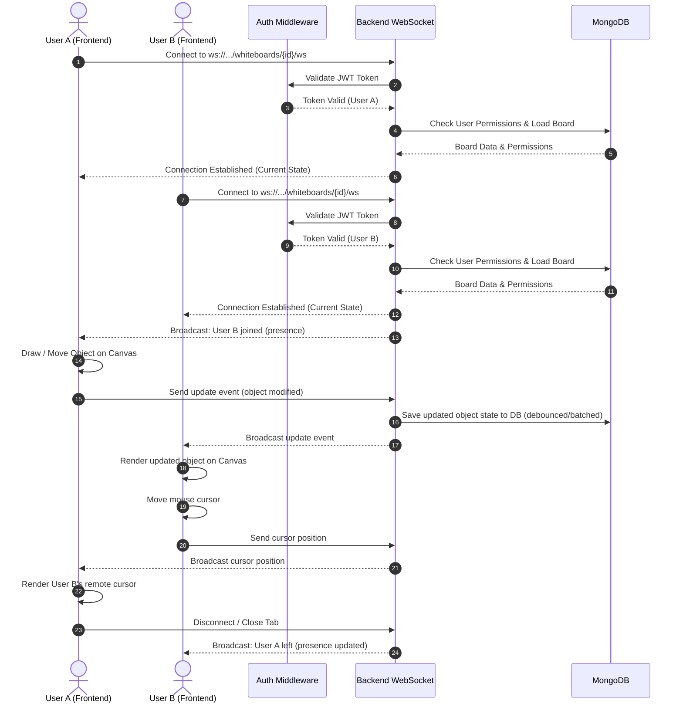

# Sequence Flow Diagram

```mermaid
sequenceDiagram
    autonumber
    actor UserA as User A (Frontend)
    actor UserB as User B (Frontend)
    participant Auth as Auth Middleware
    participant WS as Backend WebSocket
    participant DB as MongoDB

    %% Connection Phase
    UserA->>WS: Connect to ws://.../whiteboards/{id}/ws
    WS->>Auth: Validate JWT Token
    Auth-->>WS: Token Valid (User A)
    WS->>DB: Check User Permissions & Load Board
    DB-->>WS: Board Data & Permissions
    WS-->>UserA: Connection Established (Current State)
    
    UserB->>WS: Connect to ws://.../whiteboards/{id}/ws
    WS->>Auth: Validate JWT Token
    Auth-->>WS: Token Valid (User B)
    WS->>DB: Check User Permissions & Load Board
    DB-->>WS: Board Data & Permissions
    WS-->>UserB: Connection Established (Current State)
    WS-->>UserA: Broadcast: User B joined (presence)

    %% Real-time Collaboration Phase
    UserA->>UserA: Draw / Move Object on Canvas
    UserA->>WS: Send update event (object modified)
    WS->>DB: Save updated object state to DB (debounced/batched)
    WS-->>UserB: Broadcast update event
    UserB->>UserB: Render updated object on Canvas

    UserB->>UserB: Move mouse cursor
    UserB->>WS: Send cursor position
    WS-->>UserA: Broadcast cursor position
    UserA->>UserA: Render User B's remote cursor

    %% Disconnection Phase
    UserA->>WS: Disconnect / Close Tab
    WS-->>UserB: Broadcast: User A left (presence updated)
```
